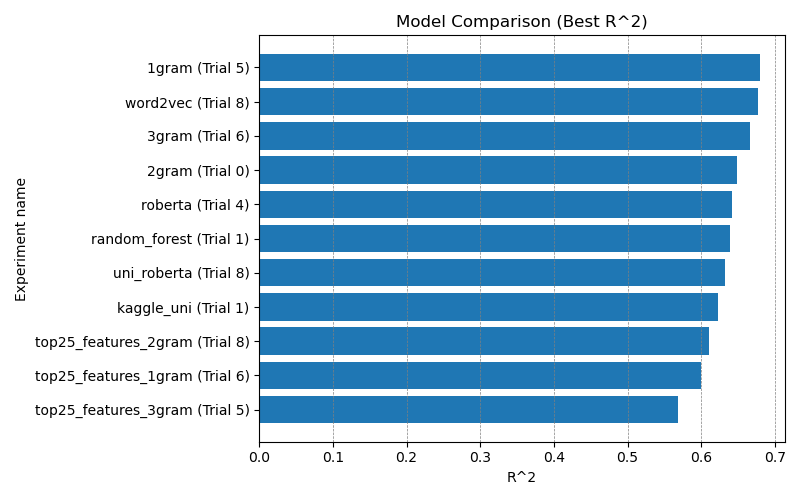
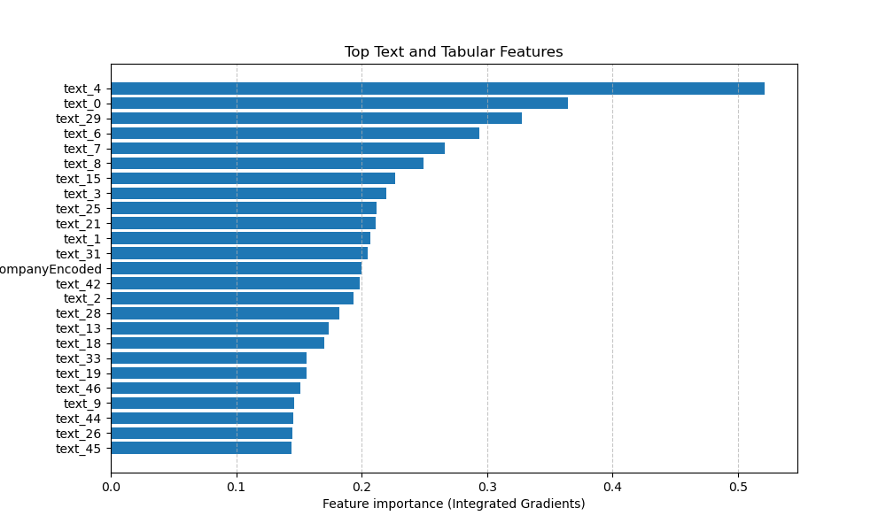
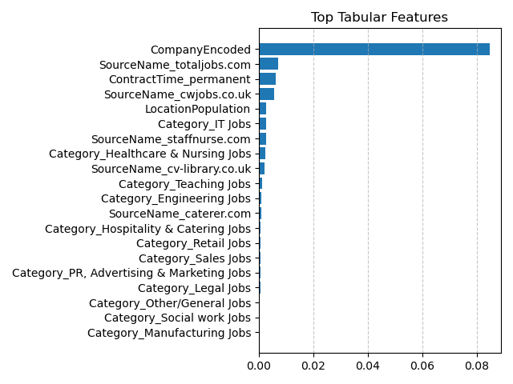

# Job Salary Prediction

This project focuses on **predicting salaries based on job advertisements**. Several **multimodal models**, combining **textual** and **tabular data**, were compared to evaluate their performance.

## Dataset

The main dataset **`Job Salary Prediction`** is available [here: ](https://www.kaggle.com/competitions/job-salary-prediction/data)

  

### Converting Location to Population

The dataset contains text columns such as `Title`, `FullDescription`, `LocationNormalized`, and `Company`.

As part of data preprocessing, the `location` column, which originally contained **city, region, and country names**, was converted into the **population of the corresponding location**.  

Population data was collected in two ways:  

1. **Web scraping from Wikipedia**  
2. **Using popular datasets:**
  - [GeoNames](https://download.geonames.org/export/dump/)
  - [NUTS (UK Boundaries)](https://www.data.gov.uk/dataset/ba66b4fc-34a0-4323-ae9a-118ab8929552/nuts-level-1-january-2018-boundaries-uk-bsc?utm_source=chatgpt.com)  

### Text Embedding Methods

The `Title` and `FullDescription` columns were processed using the following methods to convert text into numerical embeddings:  

- **Tf-idf**  
- **Word2Vec**  
- **N-grams** (uni-, bi-, tri-)  
- **Transformer (Roberta)**  

### Other

The `Company` column was preprocessed using target encoding, replacing it with the average salary for each company.  
Additionally, the `SourceName` column was limited to the most common platforms in each category.

## Model Comparison

Model comparison focused primarily on the text processing methods. In addition, **neural networks** and **random forests** were evaluated.  

The `kaggle_uni` model was used to estimate potential Kaggle ranking, achieving **39th place**. This result reflects a late-stage experiment using the competition's test set and was not intended to achieve the absolute best performance. The primary goal of the project was to **explore and learn different methods**, rather than performing extensive training for maximum score.

### Feature Importance Analysis

To simplify the model, the **25 most important features** were selected using **Information Gain (IG)**.

- **All features:**  
  
- **Tabular features only:**  

